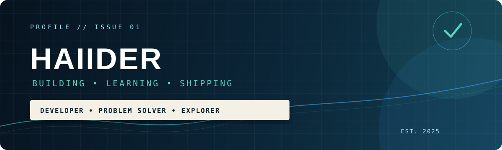

 

## Hello, I’m Haiider

I’m a developer who enjoys turning ideas into useful, well-structured digital experiences. I’m focused on learning continuously, building practical projects, and growing through real-world problem solving.

> **Build with curiosity. Improve with consistency. Share what you learn.**

### What I’m working on

| Focus | Direction |
|---|---|
| **Development** | Building clean, useful software and improving my technical foundations. |
| **Learning** | Exploring modern tools, better engineering habits, and open-source practices. |
| **Collaboration** | Connecting with people who enjoy creating, learning, and sharing knowledge. |

### My approach

I value readable code, thoughtful design, and steady progress. Whether I am working on a small experiment or a larger project, I try to keep the experience simple, purposeful, and easy to improve.

### Connect with me

If you would like to talk about technology, projects, learning, or collaboration, feel free to reach out.

<a href="https://www.linkedin.com/in/haiider820"><strong>LinkedIn</strong></a>
&nbsp;&nbsp;•&nbsp;&nbsp;
<a href="mailto:haiider820@gmail.com"><strong>Email</strong></a>

  

