  

  
  
  

---

### 👤 About Me

- 🎓 **Education:** Software Engineering @ COMSATS University Islamabad
- ⚙️ **Core Focus:** Flutter development, with on-device & hybrid AI inference for real-time mobile apps
- 💼 **Experience:** 1+ year professional Flutter development
- 📍 **Based in:** Wah Cantt, Pakistan
- 💡 **Motto:** *"Build with curiosity. Improve with consistency. Share what you learn."*

---

### 🚀 Featured Projects

<table>
<tr>
<td width="50%" valign="top">

**📈 TradeMind AI**
Real-time crypto trading platform with live Binance WebSocket integration and a self-learning ML layer — automatic coin selection, entry-point detection, and dynamic TP/SL. Evolving toward a fully autonomous trading agent with live execution.
`Flutter` `Binance API` `ML` `WebSockets`

</td>
<td width="50%" valign="top">

**🎓 VisioSpark**
University event management system built to streamline event creation, registration, and coordination end-to-end.
`Flutter` `Laravel` `MySQL`

</td>
</tr>
<tr>
<td width="50%" valign="top">

**🔒 Light VPN**
A lightweight VPN app with a Flutter frontend backed by FastAPI and Firebase.
`Flutter` `FastAPI` `Firebase`

</td>
<td width="50%" valign="top">

**🏚️ Rust & Riches**
An idle/tycoon mobile game built around garage-restoration mechanics and progression loops.
`Flutter` `Game Dev`

</td>
</tr>
<tr>
<td width="50%" valign="top">

**💬 AI Chat App**
A conversational AI app powered by GPT-based chat features for natural, real-time interaction.
`Flutter` `GPT` `Conversational AI`

</td>
<td width="50%" valign="top"></td>
</tr>
</table>

---

### 🛠️ Tech Stack & Tooling

---

### 📬 Contact

You could also **FOLLOW** me here on GitHub! 🫡

---

  <!-- Streak Stats -->
  

    

  <!-- Stats & Top Languages side by side -->
  

    
    &nbsp;
    
  

   

  <!-- Profile summary card -->
  

    
  

    

  <!-- Animated typewriter footer -->
  

